# useCallback Hook Example

This project demonstrates the usage of the `useCallback` hook in React, focusing on optimizing function references to prevent unnecessary re-renders of child components.

## 📌 Features
- **Function Memoization**: Prevents re-creating functions on every render.
- **Optimized Re-Renders**: Ensures child components re-render only when necessary.
- **Better Performance**: Reduces unnecessary computations in React components.

## 🔹 Key Learnings

### 1️⃣ Preventing Unnecessary Re-Renders
By default, functions in React are recreated every render, causing child components that receive them as props to re-render. `useCallback` memoizes the function so it is only re-created when dependencies change.

```tsx
const getItems = useCallback(() => {
  return [number, number + 1, number + 2];
}, [number]); // Renders only when number changes
```
This ensures that the function is not recreated unnecessarily, reducing unnecessary updates to child components.

### 2️⃣ Difference Between `useCallback` and `useMemo`
- **`useCallback`** returns a memoized function.
- **`useMemo`** returns a memoized value.

`useCallback` is useful when passing functions as props to child components to avoid triggering unnecessary renders.

### 3️⃣ Using `useCallback` with `useEffect`
Since `useCallback` ensures the function reference remains the same unless dependencies change, it prevents unnecessary effect re-runs in child components.

```tsx
useEffect(() => {
  setItems(getItems()); // Calls the memoized function
  console.log("Updating Items");
}, [getItems]);
```
This prevents `useEffect` from running every time the parent component re-renders.

## 🔹 Flowchart Representation
Below is a flowchart explaining how `useCallback` optimizes function references and prevents unnecessary re-renders:

```mermaid
graph TD
  A[User Interaction] --> B[Changes number]
  B --> C[App re-renders ✅]
  C --> D[getItems reference changes ✅]
  D --> E[List re-renders ✅ because getItems is a dependency]
  E --> F[Updating Items logs in console ✅]
  
  A --> G[Toggles theme]
  G --> H[Only App re-renders ✅]
  H --> I[getItems reference remains the same ✅]
  I --> J[List does NOT re-render ✅]
  J --> K[No Updating Items log in console ✅]
  
  A --> L[No state change]
  L --> M[No re-render ❌]
```



## 📄 Common Documentation
For installation instructions and an overview of the entire **Course**, refer to the main [README.md](../README.md) in the root folder.

