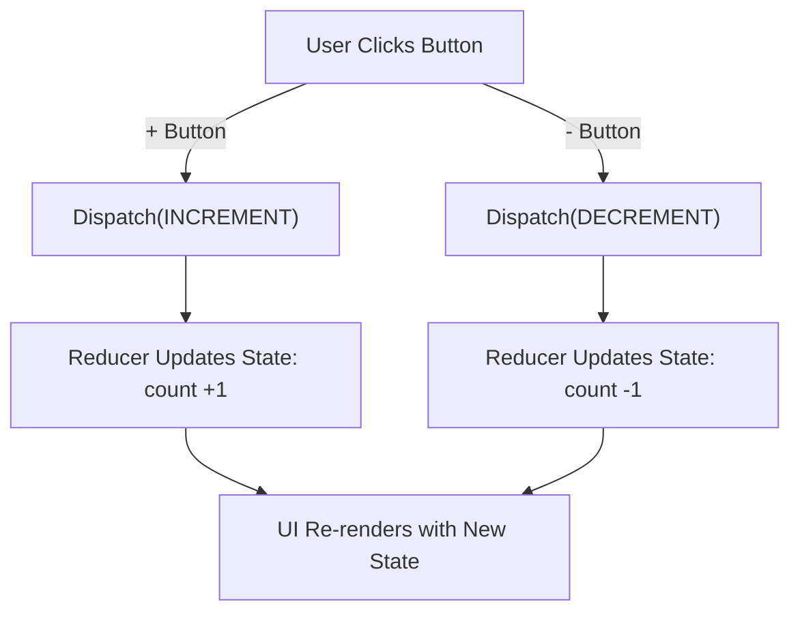

# **useReducer Hook Example**  

This project demonstrates the usage of the `useReducer` hook in React, focusing on **state management** when dealing with multiple updates and complex logic.  

## 📌 **Features**  
- **Centralized State Management**: Handles state updates through a reducer function.  
- **Improved Performance**: Suitable for managing **complex state transitions**.  
- **Scalable Approach**: Better than `useState` when handling multiple related state changes.  

## 🔹 **Key Learnings**  

### **1️⃣ Basic Counter with `useReducer`**  

The `useReducer` hook is useful when **state transitions depend on actions**. Instead of directly updating the state using `useState`, we dispatch actions to a reducer.  

#### **How It Works:**  
- The **`dispatch` function** sends an action object `{ type: ACTION }` to the `reducer`.  
- The `reducer` **modifies the state** based on the action type.  
- This makes state updates more structured and **avoids direct state mutation**.  

---

### **2️⃣ Todo List with `useReducer`**  

In a **real-world application**, state updates often involve **multiple properties** (e.g., adding, deleting, and toggling todos). Using `useReducer` keeps logic clean.  

#### **How It Works:**  
- The `dispatch` function **triggers actions** (`ADD_TODO`, `TOGGLE_TODO`, `DELETE_TODO`).  
- The `reducer` processes these actions and returns an updated todo list.  
- The **state updates remain centralized**, making debugging easier.  

---

## 🔄 **Flowchart for Counter App with `useReducer`**  

This flowchart explains how **user actions trigger state updates** in the counter app.  

✅ **Explanation:**  
1️⃣ The **user clicks a button** (`+` or `-`).  
2️⃣ An **action is dispatched** (`INCREMENT` or `DECREMENT`).  
3️⃣ The **reducer function updates the state** accordingly.  
4️⃣ The **React UI re-renders** to reflect the new count.  

---

## 📄 **Common Documentation**  
For installation instructions and an overview of the entire **Course**, refer to the main [README.md](../README.md) in the root folder.